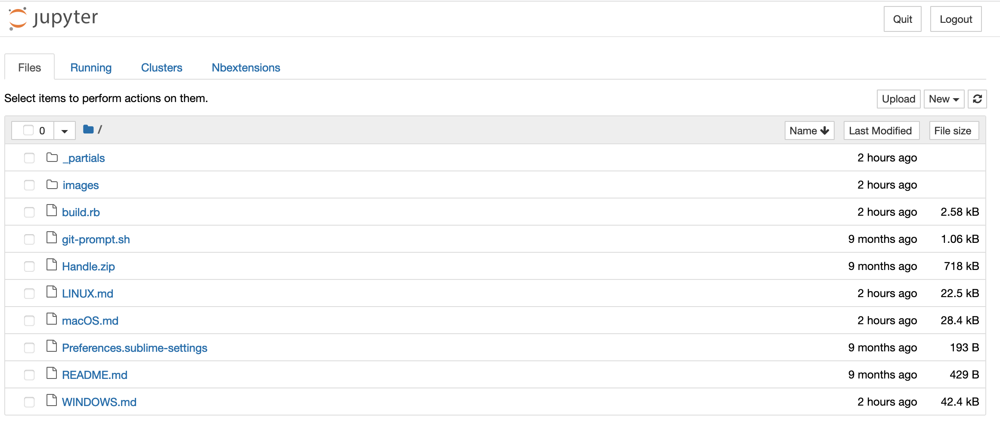
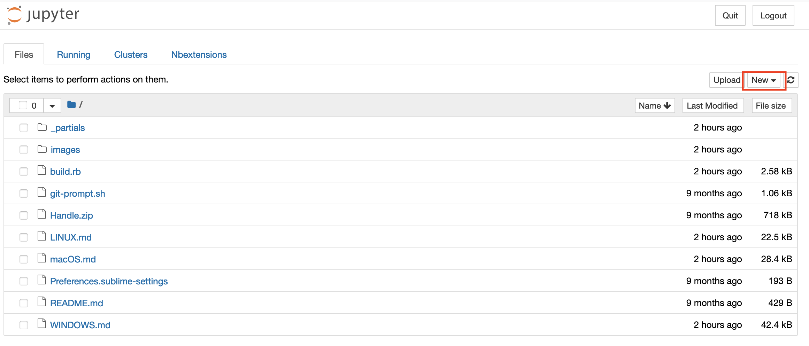
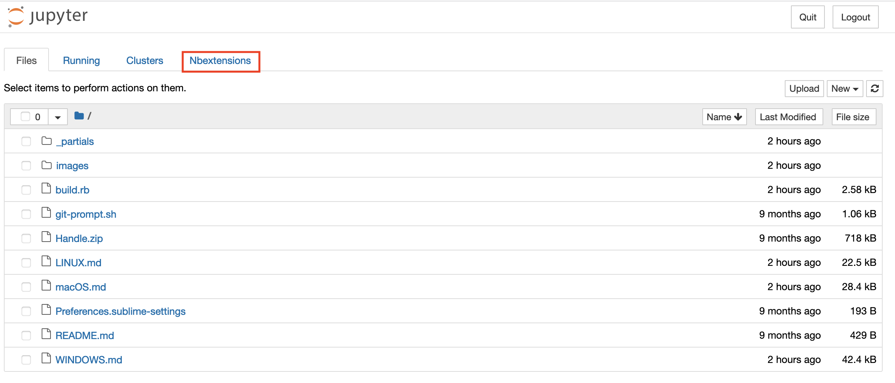
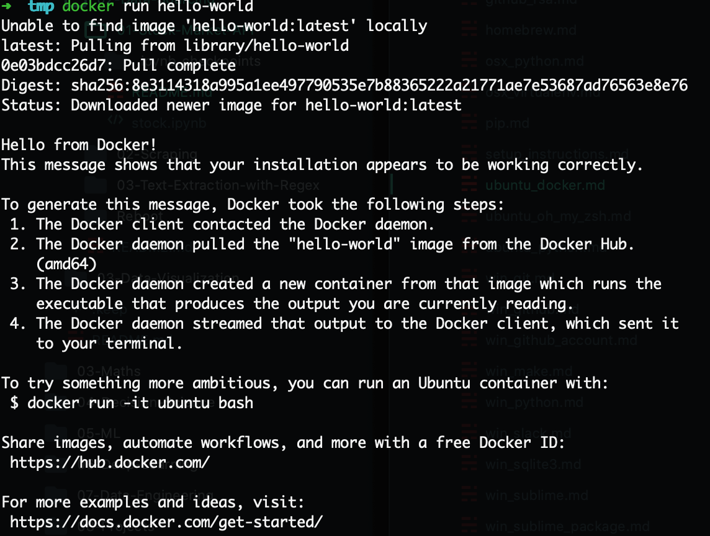
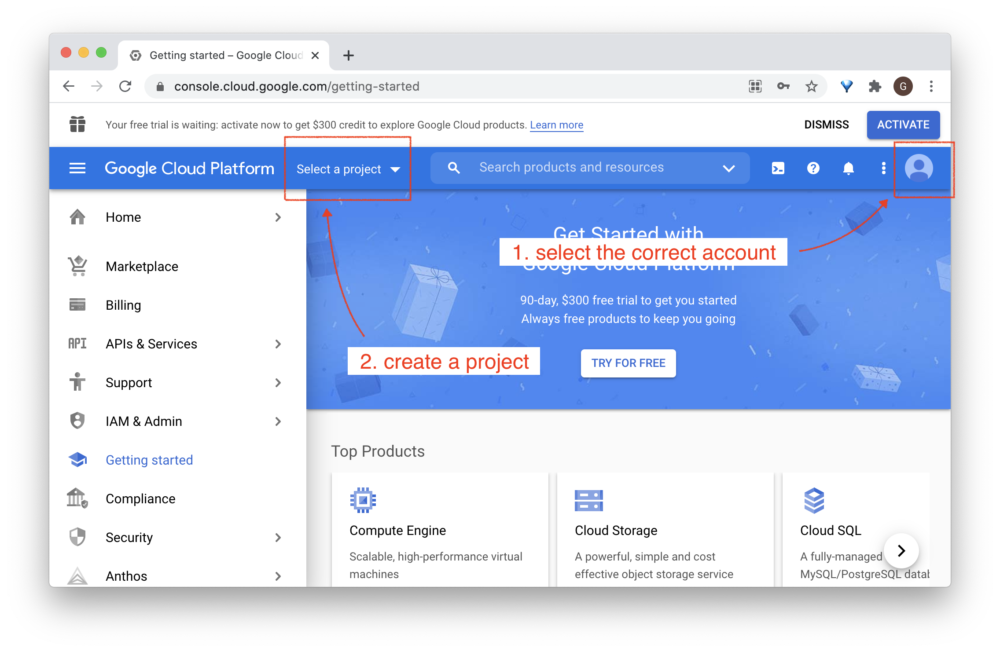

# Setup instructions

The following instructions will help you to get ready for [Le Wagon](http://www.lewagon.com) Data Science bootcamp:

- Grab a text editor
- Install a package manager
- Pimp your Terminal
- Setup git and GitHub
- Install remote tools
- Install [Python 3](https://www.python.org/) and packages to manage [Virtual Environments](https://docs.python.org/3/tutorial/venv.html)
- Install [Docker](https://docs.docker.com/get-docker/)
- Install Slack
- Onboard on **Kitt**, Le Wagon's pedagogic platform


## Remote tools

To be able to interact when we are not in the same physical room, we will be using two tools:

### Zoom

⚠️ If you already have Zoom installed, please make sure that the version is at least **5.4**. Otherwise, you will not be able to use breakout rooms in order to work with your buddy.

Zoom is a video conferencing tool. To create an account and install the app, go to [https://zoom.us/download](https://zoom.us/download) and under **Zoom Client for Meetings** click the **Download** button. Open the file you have just downloaded. A progress bar will appear, then Zoom will start. Click on **Connection** and create an account with the **Sign Up Free** option:


Once connected, you should see:


You can close Zoom now.

### Teamviewer

For the most complicated problems, a teacher might have to take control of your computer. To be able to do this, we will need to use the Teamviewer tool. Go to the [Teamviewer download page](https://www.teamviewer.com/en/download). It should automatically detect your operating system. If it doesn't, choose your operating system from the list at the top of the page. Click on **Download Teamviewer** and open the file you just have downloaded. Leave the default settings as they are and click on **Accept**. A progress bar will appear, then Teamviewer will start when the installation is over. It should look like this:


This will only be used as last resort when debugging becomes too tricky through spoken word. Nobody will ever be able to take control of your screen without you knowing it :ok_hand:

You can close Teamviewer now.

If you are not familiar with video calls, here is a great [article](https://martinfowler.com/articles/effective-video-calls.html) full of good practices :camera: :microphone:


## GitHub account

Have you signed up to GitHub? If not, [do it right away](https://github.com/join).

:point_right: **[Upload a picture](https://github.com/settings/profile)** and put your name correctly on your GitHub account. This is important as we'll use an internal dashboard with your avatars. Please do this **now**, before you continue with this guide.


## Git

To install `git`, first open a terminal. To open a terminal, you can click on the Ubuntu Start button in the sidebar and type `Terminal`. Then click on the terminal icon.

Then copy this line with `Ctrl` + `C`:

```bash
sudo apt install -y git
```

:bulb: To **paste it in the terminal**, you need to use `Ctrl` + `Shift` + `V`.


Let's now install GitHub [official CLI](https://cli.github.com) (Command Line Interface) with the following commands:

```bash
sudo apt-key adv --keyserver hkp://keyserver.ubuntu.com:80 --recv-key C99B11DEB97541F0
sudo apt-add-repository https://cli.github.com/packages
sudo apt update
sudo apt install -y gh
```

To check that `gh` has been successfully installed on your machine, you can run:

```bash
gh --version
```

If you don't get a prompt saying `gh version X.Y.Z (YYYY-MM-DD)` with at least version 1.4, please refer to [the documentation](https://github.com/cli/cli/blob/trunk/docs/install_linux.md#official-sources) where they list some troubleshooting information. In doubt, ask a TA.


## Visual Studio Code - Your text editor

A text editor is one of the most important tools of a developer.
Follow these instructions in the Terminal **one by one** (don't copy and paste everything at once):

```bash
wget -q https://packages.microsoft.com/keys/microsoft.asc -O- | sudo apt-key add -
sudo add-apt-repository "deb [arch=amd64] https://packages.microsoft.com/repos/vscode stable main"
sudo apt update
sudo apt install code
```

:point_up: This command will ask for your password with: `[sudo] password for <username>:`. Don't panick! Calmly type your password key by key. You won't have a visual feedback (like little `*`), that's **perfectly normal**, keep on typing. When you're done, hit `Enter` :muscle:.

Now let's try to launch your VS Code from **the Terminal**:

```bash
code
```
If the text editor opens in a new window, you can move forward!


### VS Code Extensions

Let's gain time now and add other extensions that will be helpful during your Bootcamp:

```bash
code --install-extension ms-vscode.sublime-keybindings ms-python.python ms-toolsai.jupyter KevinRose.vsc-python-indent MS-vsliveshare.vsliveshare ms-python.vscode-pylance
```

### VS Code Settings

- On macOS, press `Cmd` + `,` on your keyboard (or `Ctrl` + `,` on Windows or Linux) to open the settings
- Click on the `Open Settings (JSON)`


Paste the following just before the last `}`:

```bash
"emmet.triggerExpansionOnTab": true,
"emmet.includeLanguages": {
  "erb": "html"
},
"python.pythonPath": "~/.pyenv/shims/python",
"python.formatting.provider": "yapf",
"workbench.settings.editor": "json",
"workbench.settings.openDefaultSettings": true,
"workbench.settings.useSplitJSON": true,
"files.exclude": {
  "**/.pytest_cache": true,
  "**/.ipynb_checkpoints": true,
  "**/__pycache__": true,
  "**/.egg-info": true,
},
```

It should look like this:


:warning: You should add a comma if there is none after the **`]`** like line 26 in the image above :point_up:

:warning: Don't forget to save those changes!


## Oh-my-zsh - Fancy your Terminal

We will use the shell named `zsh` instead of `bash`, the default one.

```bash
sudo apt install -y zsh curl vim
sh -c "$(curl -fsSL https://raw.githubusercontent.com/robbyrussell/oh-my-zsh/master/tools/install.sh)"
# it will ask for your session password
```

Be careful, those commands will ask you to type your password twice. At the end
your prompt should look like this:


If it doesn't, **ask a teacher**.

To make this change stick, restart your laptop (or virtual machine):

```bash
sudo reboot
```


## GitHub

### Already configured?

Then try this command:

```bash
ssh -T git@github.com
```

If it returns the following:

```bash
# Hi <your_github_nickname>! You've successfully authenticated, but GitHub does not provide shell access
```

It means `git` is **already** configured on your laptop, you can skip the section below!

### Configuring your first SSH key

We need to generate SSH keys which are going to be used by GitHub and Heroku
to authenticate you. Think of it as a way to log in, but different from the
well known username/password couple. If you already generated keys
that you already use with other services, you can skip this step.

Open a terminal and type this, replacing the email with **yours** (the
same one you used to create your GitHub account). It will prompt
for information. Just press enter until it asks for a **passphrase**.

```bash
mkdir -p ~/.ssh && ssh-keygen -t ed25519 -o -a 100 -f ~/.ssh/id_ed25519 -C "TYPE_YOUR_EMAIL@HERE.com"
```

**NB:** when asked for a passphrase, put something you want (and that you'll remember),
it's a password to protect your private key stored on your hard drive. You'll type,
nothing will show up on the screen, **that's normal**. Just type the passphrase,
and when you're done, press `Enter`.

Then you need to give your **public** key to GitHub. Run:

```bash
cat ~/.ssh/id_ed25519.pub
```

It will prompt on the screen the content of the `id_ed25519.pub` file. Copy that text,
then go to [github.com/settings/ssh](https://github.com/settings/ssh). Click on
**Add SSH key**, fill in the Title with your computer name, and paste the **Key**.
Finish by clicking on the **Add key** green button.

To check that this step is completed, in the terminal run this. You will be
prompted a warning, type `yes` then `Enter`.

```bash
ssh -T git@github.com
```

If you see something like this, you're done!

```bash
# Hi <your_github_nickname>! You've successfully authenticated, but GitHub does not provide shell access
```

Don't be in a rush, take time to [read this article](http://sebastien.saunier.me/blog/2015/05/10/github-public-key-authentication.html) to get a better
understanding of what those keys are used for.


## GitHub CLI

CLI is the acronym of [Command-line Interface](https://en.wikipedia.org/wiki/Command-line_interface).

In this section, we will install [GitHub CLI](https://cli.github.com/) to perform useful actions with GitHub data directly from the Terminal.

It should already be installed on your laptop from the previous commands. First you need to **login**:

```bash
gh auth login -s 'user:email' -w
```

You will get the following output:

```bash
- Logging into github.com

! First copy your one-time code: 0EF9-D015
- Press Enter to open github.com in your browser...
```

Select and copy the code (`0EF9-D015` in the example), then type `Enter`. Your browser will open and ask you to authorize GitHub CLI to use your GitHub account. Accept and wait a bit. Come back to the terminal, type `Enter` again, and that should be it :tada:

To check that you are properly connected, type:

```bash
gh auth status
```

If you get `Logged in to github.com as <YOUR USERNAME> `, then all good. If not, **ask a teacher**.

Then run the following configuration line:

```bash
gh config set git_protocol ssh
```

Finally, create a [gist](https://docs.github.com/en/free-pro-team@latest/github/writing-on-github/editing-and-sharing-content-with-gists) to make sure `gh` is working:

```bash
echo "Hello [Le Wagon](https://www.lewagon.com) :wave:" | gh gist create -d "Starting my coding journey..." -f "SETUP_DAY.md" -p -w
```

This line should open your browser on the newly created gist page. See, we've just created a [**Markdown**](https://guides.github.com/features/mastering-markdown/) file!


## Google Cloud CLI

Install the `gcloud` CLI to communicate with [Google Cloud Platform](https://cloud.google.com/) through your terminal:
```bash
echo "deb [signed-by=/usr/share/keyrings/cloud.google.gpg] https://packages.cloud.google.com/apt cloud-sdk main" | sudo tee -a /etc/apt/sources.list.d/google-cloud-sdk.list
sudo apt-get install apt-transport-https ca-certificates gnupg
curl https://packages.cloud.google.com/apt/doc/apt-key.gpg | sudo apt-key --keyring /usr/share/keyrings/cloud.google.gpg add -
sudo apt-get update && sudo apt-get install google-cloud-sdk
sudo apt-get install google-cloud-sdk-app-engine-python
```
👉 [Install documentation](https://cloud.google.com/sdk/docs/install#deb)


## Dotfiles

There are three options, choose _one_:

### 1. I already attended Web Development (FullStack) bootcamp at Le Wagon _on the same laptop_

This means that you already forked the GitHub repo `lewagon/dotfiles`, but at that time the configuration was maybe not ready for the new Data Science bootcamp.

Open your terminal and go to your `dotfiles` project:

```bash
cd ~/code/<YOUR_GITHUB_NICKNAME>/dotfiles
code . # Open it in VS Code
```

In VS Code, open the `zshrc` file. Replace its content with the [newest version](https://raw.githubusercontent.com/lewagon/dotfiles/master/zshrc) of that file that we provide. Save to disk.

Back to the terminal, run a `git diff` and ask a TA to come and check about this configuration change. You should see stuff about Python and `pyenv`.

Once this is good, commit and push your changes:

```bash
git add zshrc
git commit -m "Update zshrc for Data Science bootcamp"
git push origin master
```

### 2. I did not attend the Web Dev bootcamp at Le Wagon

Hackers love to refine and polish their shell and tools. We'll start with a great default configuration provided by [Le Wagon](http://github.com/lewagon/dotfiles), stored on GitHub. As your configuration is personal, you need your own repository storing it, so you first need to fork it to your GitHub account.

:arrow_right: [Click here to **fork**](https://github.com/lewagon/dotfiles/fork) the `lewagon/dotfiles` repository to your account (you'll need to click again on your picture to confirm _where_ you do the fork).

Forking means that it will create a new repo in your GitHub account, identical to the original one. You'll have a new repository on your GitHub account, `your_github_username/dotfiles`. We need to fork because each of you will need to put specific information (e.g. your name) in those
files.

Now this is done, go on with the following instructions under in the `3. ` section right below. :warning: DO NOT SKIP IT!

### 3. I already attended Web Development (FullStack) bootcamp at Le Wagon _but I have a new laptop_

Open your terminal and run the following command:

```bash
export GITHUB_USERNAME=`gh api user | jq -r '.login'`
echo $GITHUB_USERNAME
```

You should see your GitHub username printed. If it's not the case, **stop here** and ask for help.
There seems to be a problem with the previous step (`gh auth`).

Time to fork the repo and clone it on your laptop:

```bash
mkdir -p ~/code/$GITHUB_USERNAME && cd $_
gh repo fork lewagon/dotfiles --clone
```

Run the `dotfiles` installer.

```bash
cd ~/code/$GITHUB_USERNAME/dotfiles && zsh install.sh
```

Check the emails registered with your GitHub Account. You'll need to pick one
at the next step:

```bash
gh api user/emails | jq -r '.[].email'
```

Run the git installer:

```bash
cd ~/code/$GITHUB_USERNAME/dotfiles && zsh git_setup.sh
```

:point_up: This will **prompt** you for your name (`FirstName LastName`) and your email. Be careful
you **need** to put one of the email listed above thanks to the previous `gh api ...` command. If you
don't do that, Kitt won't be able to track your progress.

Please now **quit** all your opened terminal windows.


&nbsp;


Let us open the `~/.zshrc` profile file in VS Code and change slightly its content:

```bash
code ~/.zshrc
```

- Locate the line `# Actually load Oh-My-Zsh`
- **Above it** write the following line:

```bash
ZSH_DISABLE_COMPFIX=true
```

&nbsp;


You don't want to be asked for your passphrase every time you communicate with a distant repository. So you need to add the plugin `ssh-agent` to `oh my zsh`:


- Spot the line starting with `plugins=`
- Add `ssh-agent` to the plugins list.

The list should look like:

```
plugins=(gitfast last-working-dir common-aliases sublime zsh-syntax-highlighting history-substring-search pyenv ssh-agent)
```

&nbsp;


&nbsp;&nbsp;&nbsp; :white_check_mark: Save the `.zshrc` file with `Ctrl` + `S` and close VS Code.


## Installing Python (with [`pyenv`](https://github.com/pyenv/pyenv))

Ubuntu comes with an outdated version of Python that we don't want to use. You might already have installed Anaconda or something else to tinker with Python and Data Science packages. All of this does not really matter as we are going to do a professional setup of Python where you'll be able to switch which version you want to use whenever you type `python` in the terminal.

First let's install `pyenv` with the following Terminal command:

```bash
git clone https://github.com/pyenv/pyenv.git ~/.pyenv
```

Then quit **all your opened terminal windows** (`Cmd` + `Q`) and restart one. Ignore the `pyenv: no such command 'virtualenv-init' for now`.

Let's install some [dependencies](https://github.com/pyenv/pyenv/wiki/common-build-problems#prerequisites) needed to build Python from `pyenv`:

```bash
sudo apt install -y make build-essential libssl-dev zlib1g-dev libbz2-dev \
  libreadline-dev libsqlite3-dev llvm libncurses5-dev libncursesw5-dev \
  xz-utils tk-dev libffi-dev liblzma-dev python-openssl
```

Let's install the [latest stable version of Python](https://www.python.org/doc/versions/) supported by Le Wagon's curriculum:

```bash
pyenv install 3.8.6
```

This command might take a while, this is perfectly normal. Don't hesitate to help other students seated next to you!

OK once this command is complete, we are going to tell the system to use this version of Python **by default**. This is done with:

```bash
pyenv global 3.8.6
```

Once again, quit **all your opened terminal windows** (`Cmd` + `Q`) and restart one.

To check if this worked, run `python --version`. If you see `3.8.6`, perfect! If not, ask a TA that will help you debug the problem thanks to `pyenv versions` and `type -a python` (`python` should be using the `.pyenv/shims` version first).


## Python Virtual Environment

Before we start installing relevant Python packages, we will isolate the setup for the Bootcamp into a **dedicated** virtual environment. We will use a `pyenv` plugin called [`pyenv-virtualenv`](https://github.com/pyenv/pyenv-virtualenv).

First let's install this plugin:

```bash
git clone https://github.com/pyenv/pyenv-virtualenv.git $(pyenv root)/plugins/pyenv-virtualenv
```

Once again, quit **all your opened terminal windows** (`Cmd` + `Q`) and restart one.

Let's create the virtual environment we are going to use during the whole bootcamp:

```bash
pyenv virtualenv 3.8.6 lewagon
```

Let's now set the virtual environment with:

```bash
pyenv global lewagon
```

Great! Anytime we'll install Python package, we'll do it in that environment.


## Python packages

Now that we have a pristine `lewagon` virtual environment, it's time to install some packages in it.

First, let's upgrade `pip`, the tool to install Python Packages from [pypi.org](https://pypi.org). In the latest Ubuntu terminal where the virtualenv `lewagon` is activated, run:

```bash
pip install --upgrade pip
```

Then let's install some packages for the first weeks of the program:

```bash
pip install pytest pylint ipdb pyyaml nbresult autopep8 flake8 lxml yapf
```

Let's install packages useful for API & Scraping:

```bash
pip install requests bs4
```

Finally, more Data Science packages:

```bash
pip install jupyterlab pandas matplotlib seaborn plotly scikit-learn tensorflow nbconvert xgboost statsmodels pandas-profiling jupyter-resource-usage
```

### Packages check up

Run the following command to check if you successfully installed the required packages:
```bash
curl https://gist.githubusercontent.com/krokrob/2e5a61b20582b55bbb034c4ea1e9f633/raw/9648336201de2db5932bc6d02ad72ee0cb947992/pip_check.sh > pip_check.sh && zsh pip_check.sh && rm pip_check.sh
```

Now run the following command to check if you can load these packages:
```bash
curl https://gist.githubusercontent.com/krokrob/90e35dee7ed2b20852b099331510b369/raw/09178c49db6e7537eed68335a25fbb00c7ca1fd4/pip_check.py > pip_check.py && python pip_check.py && rm pip_check.py
```

That's it for today. During the bootcamp, we'll install more packages but we'll talk about that later.


## `jupyter` notebook extensions

Pimp your `jupyter` notebooks with awesome extensions:

```bash
# install nbextensions
pip install jupyter_contrib_nbextensions
pip install jupyter_nbextensions_configurator
jupyter contrib nbextension install --user
jupyter nbextension enable toc2/main
jupyter nbextension enable collapsible_headings/main
jupyter nbextension enable spellchecker/main
jupyter nbextension enable code_prettify/
```

### Sublime Text shortcuts

[Add sublime text shortcuts to jupyter notebook](http://blog.rtwilson.com/how-to-get-sublime-text-style-editing-in-the-ipythonjupyter-notebook/)

Find the `jupyter` config directory:
``` bash
JUPYTER_CONFIG_DIR=$(jupyter --config-dir)
```

Open `custom/custom.js` in the config directory:
```bash
cd $JUPYTER_CONFIG_DIR
code custom/custom.js
```
Edit `custom.js` with:
``` js
require(["codemirror/keymap/sublime", "notebook/js/cell", "base/js/namespace"],
    function(sublime_keymap, cell, IPython) {
        // setTimeout(function(){ // uncomment line to fake race-condition
        cell.Cell.options_default.cm_config.keyMap = 'sublime';
        var cells = IPython.notebook.get_cells();
        for(var cl=0; cl< cells.length ; cl++){
            cells[cl].code_mirror.setOption('keyMap', 'sublime');
        }
        // }, 1000)// uncomment  line to fake race condition
    }
);
```

You can close VS Code.

### `jupyter` check up

Check you can launch a notebook server on your machine:
```bash
jupyter notebook
```
Your web browser should open on a `jupyter` window:



Click on `New`:



A tab should open on a new notebook:


### `nbextensions` check up

Perform a sanity check for `jupyter notebooks nbextensions`. Click on `Nbextensions`:



Check that the `nbextensions` are enabled:


You can close your web browser then terminate the jupyter server with `CTRL` + `C`.


## Docker 🐋

Docker is an open platform for developing, shipping, and running applications.

_if you already have Docker installed on your machine please update with the latest version_

### Install Docker

Go to [Docker install documentation](https://docs.docker.com/engine/install/ubuntu/#install-using-the-repository).

Then follow the tutorial instructions to install Docker **using the repository**. There are 2 steps:

- SET UP THE REPOSITORY
- INSTALL DOCKER ENGINE

Once done, you should be able to run:

```bash
sudo service docker start
```

```bash
sudo docker run hello-world
```

The following message should print:



```bash
sudo service docker stop
```


## Ubuntu inotify

Ubuntu is always tracking changes in your folders and to do this it uses inotify.
By default the Ubuntu limit is set to 8192 files monitored.

As programming involves a lot of files, we need to raise this limit.
In your terminal run:

```bash
echo fs.inotify.max_user_watches=524288 | sudo tee -a /etc/sysctl.conf && sudo sysctl -p
```


## Extra

### Install video codec H264

On our pedagogical platform (Kitt, you'll soon discover it!), we have some videos. By default Firefox on Linux cannot play them as they use an unsupported codec (H264). To get those videos working for you, you need to run this:

```bash
sudo apt install libavcodec-extra -y
```

### Install useful terminal tools

`tree` is a nice tool to visualize a directory tree inside the terminal:

`ncdu` is a text-based interface disk utility.

`htop` is an interactive process viewer.

`tig` is a text-mode interface for `git`.

```bash
sudo apt install tree ncdu htop tig
```


## Google Cloud Platform setup

[GCP](https://cloud.google.com/) is a cloud solution that you are going to use in order to deploy your Machine Learning-based products to production.

### Project setup

- Go to [Google Cloud](https://console.cloud.google.com/) and create an account if you do not already have one
- In the Cloud Console, on the project list, select or create a Cloud project



- Give it a name such as `Wagon Bootcamp` for example
- Notice the `ID` automatically created for the project, e.g. `wagon-bootcamp-123456`


### Billing account

You will now link your account to your credit card. This step is required or you will not be able to use the services provided by GCP. Do not worry, you will be able to consume most GCP services through free credits throughout the bootcamp.


- Click on billing
- Click on MANAGE BILLING ACCOUNTS
- Click on ADD BILLING ACCOUNT
- Verify that your account is the correct one (in case you own several gmail addresses)
- Click on "I have read..." and agree the to the terms of service
- Click on CONTINUE
- Select your account type: `Individual`
- Fill your name and address

You should see that you have a free credit of "$300 credits over the next 90days".

- Click on card details
- Enter your credit card info
- Click on START MY FREE TRIAL

Once this is done, verify that your billing account is linked to your GCP project.

- Select your project
- Go to Billing
- Select LINK A BILLING ACCOUNT
- Select My Billing Account
- Click on SET ACCOUNT

You should now see:

```
Free trial status: €254.77 credit and 91 days remaining - with a full account, you'll get unlimited access to all of Google Cloud Platform.
```

<details>
  <summary>👉 If you do not own a credit card 👈</summary>


If you do not own a credit card, an alternative is to setup a **Revolut** account.
Revolut is a financial app that will allow you to create a virtual credit card linked to your mobile phone billing account.

Skip this step if you own a credit card and use your credit card for the setup.

Download the Revolut app, or go to [revolut](https://www.revolut.com/a-radically-better-account) and follow the steps to download the app (enter your mobile phone number and click on Get Started).

- Open the Revolut app
- Enter your mobile phone number
- Enter the verification code received by SMS
- The app will ask for your country, address, first and last name, date of birth, email address
- The app will also ask for a selfie and request your profession
- The app will require a photo of your identification card or passport

Once this is done, select the standard (free) plan. No need to add the card to Apple pay, or ask for a the delivery of a physical card, or add money securely.

You now have a virtual card which we will use for the GCP setup.

In the main view of the Revolut the app
- Click on Ready to use
- Click on the card
- Click on Show card details
- Note down the references of the virtual credit card and use them in order to proceed with the GCP setup

</details>

<details>
  <summary>👉 If you receive an email from Google saying `Urgent: your billing account XXXXXX-XXXXXX-XXXXXX has been suspended` 👈</summary>


This may happen especially in case you just setup a Revolut account.

- Click on PROCEED TO VERIFICATION
- You will be asked to send a picture of your credit card (only the last 4 digits, no other info)
- In case you used **Revolut**, you can send a screenshot of your virtual credit card (do not forget to remove the validity date from the screenshot)
- Explain that you are attending the Le Wagon bootcamp, do not own a credit card, and have just created a Revolut account in order to setup GCP for the bootcamp using a virtual credit card

You may receive a validation or requests for more information within 30 minutes.

Once the verification goes through, you should receive an email stating that `Your Google Cloud Platform billing account XXXXXX-XXXXXX-XXXXXX has been fully reinstated and is ready to use.`.

</details>

### Enabling GCP services

- Make sure that billing is enabled for your Google Cloud project

ℹ️ You have a **$300 credit** to use for Google Cloud resources, which will be more than enough for the bootcamp.

- [Enable the AI Platform Training & Prediction and Compute Engine APIs](https://console.cloud.google.com/flows/enableapi?apiid=ml.googleapis.com,compute_component&_ga=2.269215094.662509797.1580849510-2071889129.1567861089&_gac=1.154971594.1580849512.CjwKCAiAyeTxBRBvEiwAuM8dnbZ6uMwizbZW44J2mBCX6ncEjwjwpgF8S8QsvhYAXLkJ8awDnIRTNRoCJ_0QAvD_BwE) (This step may take a few minutes)

### Configure Cloud sdk

- Authenticate the `gcloud` CLI with the google account you used for GCP
```bash
gcloud auth login
```
- Login to your Google account on the new tab opened in your web browser
- List your active account and check your email address you used for GCP is present
```bash
gcloud auth list
```
- Set your current project (replace `PROJECT_ID` with the `ID` of your project, e.g. `wagon-bootcamp-123456`)
```bash
gcloud config set project PROJECT_ID
```
- List your active account and current project and check your project is present
```bash
gcloud config list
```

### Create a service account key 🔑

Now that you have created a `GCP account` and a `project` (identified by its `PROJECT_ID`), we are going to configure the actions (API calls) that you want to allow your code to perform.

<details>
  <summary>TL;DR</summary>
  Since API calls are not free, it may be important to define these with caution, but for the purpose of the bootcamp this will not be an issue and we are going to allow our code to use all API without any restrictions (see the project owner part later).

  As there may be several projects associated with a GCP account, a project may be composed of several services (any bundle of code, whatever its form factor, that requires the usage of GCP API calls in order to fulfill its purpose).

  GCP requires that the services of the project using API calls are registered on the platform and their credentials configured.

  Here we will only need to use a single service and will create the corresponding `service account`.

  Since the [service account](https://cloud.google.com/iam/docs/service-accounts) is what identifies your application (and therefore your GCP billing account and ultimately your credit card) when it comes to bill the performed API calls, you are going to want to be cautious with the next steps. Basically, do not let your service account json file by the coffee machine, do not send it as a tweet, do not store it in your git codebase (even if your git repository is private).
</details>

- Go to [Service Account key page](https://console.cloud.google.com/apis/credentials/serviceaccountkey)
- Create a new Service Account key :
  - Give a name to that account
  - Set Role as `project > owner`
- Download the `JSON` file, and store it somewhere you'll remember, for example `/Users/YOUR_USER_NAME/Documents/gcp_keys/YOUR_FILENAME_FOR_SECRET_KEY.json`
- Give it a name **without** any space
- Store the ****absolute access path** to the `JSON` file as an environmental variable:
```bash
echo 'export GOOGLE_APPLICATION_CREDENTIALS=/path/to/the/credentials.json' >> ~/.aliases
```
<details>
  <summary>ℹ️ How to find the absolute access path of a file?</summary>
  You can drag and drop the file in your terminal.
</details>

- **Restart** your terminal and run:
```bash
echo $GOOGLE_APPLICATION_CREDENTIALS
```
expected ouptut:
```bash
/Users/YOUR_USER_NAME/Documents/gcp_keys/YOUR_FILENAME_FOR_SECRET_KEY.json
```

- List the service accounts associated to your active account and current project
```bash
gcloud iam service-accounts list
```
- Retrieve the service account email address, e.g. `SERVICE_ACCOUNT_NAME@PROJECT_ID.iam.gserviceaccount.com`
- List the roles of the service account from the cli (replace PROJECT_ID and SERVICE_ACCOUNT_EMAIL)
```bash
gcloud projects get-iam-policy PROJECT_ID \
--flatten="bindings[].members" \
--format='table(bindings.role)' \
--filter="bindings.members:SERVICE_ACCOUNT_EMAIL"
```
- You should see that your service account has a role of `roles/owner`

<details>
  <summary>Troubleshooting</summary>

- I don't have any credit card
  - The neo-bank Revolut offers a free credit card with its [Standard plan](https://www.revolut.com/a-radically-better-account)


- `AccessDeniedException: 403 The project to be billed is associated with an absent billing account.`
  - Make sure that billing is enabled for your Google Cloud Platform project https://cloud.google.com/billing/docs/how-to/modify-project
</details>

🏁 You are done for today!


## Alumni
:warning: If you have received an email from Le Wagon inviting you to sign up on Kitt (our learning platform), you can safely skip this step. Instead, please follow the instructions in the email you received if you haven't done so already.
If you are unsure about what to do, you can follow [this link](https://kitt.lewagon.com/). If you are already logged in, you can safely skip this section. If you are not logged in, click on `Enter Kitt as a Student`. If you manage to login, you can safely skip this step. Otherwise ask a teacher whether you should have received an email or follow the instructions below.

Register as a Wagon alumni by going to [kitt.lewagon.com/onboarding](http://kitt.lewagon.com/onboarding). Select your batch, sign in with GitHub and enter all your information.

Your teacher will then validate that you are indeed part of the batch. You can ask him to do it as soon as you completed the registration form.

Once the teacher has approved your profile, go to your email inbox. You should have 2 emails:

- One from Slack, inviting you to the Le Wagon Alumni slack community (where you'll chat with your buddies and all the previous alumni). Click on **Join** and fill the information.
- One from GitHub, inviting you to `lewagon` team. **Accept it** otherwise you won't be able to access the lecture slides.


## Slack

[Install Slack for Linux (beta)](https://get.slack.help/hc/en-us/articles/212924728-Slack-for-Linux-beta-).

Launch the app and sign in to `lewagon-alumni` organization.

Make sure you upload a picture there.

You can also sign in to Slack on your iPhone or Android device!

The idea is that you'll have Slack open all day, so that you can share useful links / ask for help / decide where to go to lunch / etc.

In case of remote tickets, you will use Slack audio or video call to get help. To ensure that everything is working fine, [test your camera and microphone](https://lewagon-alumni.slack.com/help/test/calls). If your browser is asking your permission to access your microphone and camera, click on yes.

After the test are finished, you should have green "All clear" messages at least for your microphone and camera. If not, ask a teacher.


## (Bonus) Kata

If you are done with your setup, please ask around if some classmates need some help with theirs (macOS, Linux, Windows). We will have our first lectures at 2pm and will talk about the Setup you just did + onboard you on Kitt.

If you don't have a lot of experience with `git` and GitHub, please [(re-)watch this workshop](https://www.youtube.com/watch?v=Z9fIBT2NBGY) (`1.25` playback speed is fine).

If you do, then you can wait for the first lecture working on this [Tic-Tac-Toe Kata](https://www.codewars.com/kata/5b817c2a0ce070ace8002be0/train/python)


